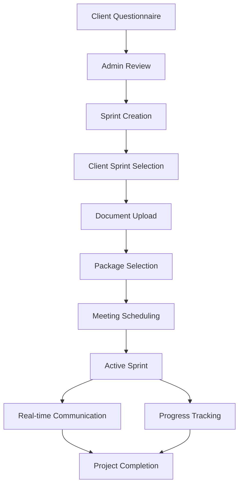

# Taotter Platform - Requirements Documentation

## Overview

This documentation package contains comprehensive requirements for the Taotter platform - a service that connects startups with experts for MVP development, validation, branding, and other startup needs.

## Platform Summary

**Taotter** is a full-stack platform that facilitates the entire journey from startup consultation to project delivery:

1. **Client Onboarding**: Multi-step questionnaire to understand startup needs
2. **Admin Processing**: Review and creation of custom sprint solutions
3. **Project Management**: Document upload, package selection, and scheduling
4. **Active Collaboration**: Real-time chat and sprint tracking
5. **Delivery**: Milestone-based project completion

## Documentation Structure

### 📋 [Functional Requirements](./functional-requirements.md)

- **Purpose**: Complete feature specifications and business rules
- **Content**:
  - Client-side features (questionnaire, dashboard, sprint management)
  - User states and permissions
  - Business logic and integration requirements
  - Future considerations

### 🔄 [User Flows](./user-flows.md)

- **Purpose**: Detailed user journey mapping and interaction patterns
- **Content**:
  - Complete client journey with Mermaid diagrams
  - Step-by-step flow breakdowns
  - Form validation and navigation rules
  - UX considerations and state management

### 🛠️ [Technical Requirements](./technical-requirements.md)

- **Purpose**: Technology stack and architecture specifications
- **Content**:
  - Backend/Frontend technology choices
  - Security, performance, and deployment requirements
  - External integrations (SMS, Email, OAuth, Calendly)
  - Testing and monitoring strategies

### 🗄️ [Database Schema](./database-schema.md)

- **Purpose**: Complete MongoDB data model design
- **Content**:
  - All collection schemas with field definitions
  - Relationships and data integrity rules
  - Indexing strategy for performance
  - Validation rules and constraints

### 🌐 [API Specifications](./api-specifications.md)

- **Purpose**: RESTful API and WebSocket documentation
- **Content**:
  - All endpoint specifications with examples
  - Authentication and authorization patterns
  - Error codes and rate limiting
  - WebSocket events for real-time features

## Technology Stack

### Backend

- **Runtime**: Node.js (v18+)
- **Framework**: Express.js
- **Database**: MongoDB with Mongoose
- **Authentication**: JWT tokens
- **Real-time**: Socket.io
- **File Storage**: Cloud storage integration
- **External APIs**: Twilio (SMS), SendGrid (Email), Google OAuth, Calendly

### Frontend

- **Framework**: React.js (v18+)
- **State Management**: Redux Toolkit + RTK Query
- **UI Framework**: Material-UI or Tailwind CSS
- **Real-time**: Socket.io-client
- **Routing**: React Router DOM

### Development & Deployment

- **Containerization**: Docker
- **CI/CD**: Automated testing and deployment
- **Monitoring**: Error tracking and performance monitoring
- **Security**: TLS encryption, input validation, rate limiting

## Key Features

### For Clients

✅ **Multi-step Questionnaire** - Capture startup needs and requirements  
✅ **Authentication** - Google OAuth and mobile verification  
✅ **Dashboard** - Status tracking and request management  
✅ **Sprint Selection** - Choose from admin-created custom options  
✅ **Document Upload** - Dynamic forms for required documents  
✅ **Package Selection** - Compare pricing and engagement options  
✅ **Meeting Scheduling** - Calendly integration for appointments  
✅ **Real-time Chat** - Communication with Taotter team  
✅ **Progress Tracking** - Monitor sprint milestones and deliverables

### For Admins

✅ **Request Review** - Approve/reject client questionnaires  
✅ **Sprint Creation** - Build custom sprint options per client  
✅ **Dynamic Forms** - Configure required document fields  
✅ **Package Management** - Set pricing and engagement options  
✅ **Team Assignment** - Allocate team members to sprints  
✅ **Progress Management** - Update milestones and deliverables  
✅ **Communication** - Real-time chat with clients

### Kanban Task Management

✅ **Visual Project Management** - Kanban boards for sprints and teams  
✅ **Drag & Drop Tasks** - Move tasks between columns seamlessly  
✅ **Advanced Filtering** - Filter by assignee, priority, tags, dates  
✅ **Task Collaboration** - Comments, mentions, and file attachments  
✅ **Time Tracking** - Log hours and track productivity  
✅ **Task Templates** - Reusable templates for common tasks  
✅ **Analytics & Reporting** - Team productivity and task completion metrics  
✅ **Bulk Operations** - Update multiple tasks simultaneously  
✅ **Tag Management** - Color-coded tags for organization  
✅ **Team Management** - Organize users into development teams

## Data Flow Architecture

## Database Collections Overview

### Core Collections

- **users** - User accounts and profiles
- **questionnaires** - Client intake forms
- **sprints** - Project management entities
- **documents** - File uploads and metadata
- **messages** - Chat communication
- **conversations** - Chat organization
- **notifications** - User notifications

### Supporting Collections

- **service_templates** - Reusable sprint templates
- **audit_logs** - System activity tracking
- **system_settings** - Configuration management

## Security & Compliance

### Authentication Security

- JWT tokens with short expiration times
- Refresh token rotation
- SMS verification for phone signup
- Google OAuth integration
- Account lockout protection

### Data Protection

- TLS 1.3 encryption in transit
- Database encryption at rest
- GDPR compliance for EU users
- Secure file upload handling
- Input validation and sanitization

### API Security

- Rate limiting per endpoint type
- CORS configuration
- Request validation with Joi schemas
- Error handling without data leakage

## Performance Requirements

### Frontend Performance

- ⚡ Initial load: < 3 seconds on 3G
- 📦 Bundle size: < 500KB gzipped
- 🎯 Core Web Vitals compliance
- 📱 Mobile-first responsive design

### Backend Performance

- ⏱️ API response time: < 200ms
- 🔄 Database query optimization
- 📈 Horizontal scaling capability
- 💾 Redis caching strategy

## Development Workflow

### Phase 1: Foundation (Current)

- ✅ Requirements documentation (Complete)
- 🔄 Project setup and basic authentication
- 🔄 Database setup and core models
- 🔄 Basic frontend structure

### Phase 2: Core Features

- 📝 Questionnaire system
- 👤 User dashboard
- 🏃‍♂️ Sprint management
- 📤 Document upload system

### Phase 3: Advanced Features

- 💬 Real-time messaging
- 📅 Calendly integration
- 📊 Progress tracking
- 📱 Notifications system

### Phase 4: Admin Features

- 🛠️ Admin panel
- 📋 Request management
- 👥 Team assignment
- 📈 Analytics and reporting

## Getting Started

### For Developers

1. Review this documentation package thoroughly
2. Set up development environment per technical requirements
3. Initialize project structure following the specified architecture
4. Implement features following the defined user flows
5. Use API specifications for frontend-backend integration

### For Stakeholders

1. Review functional requirements for feature understanding
2. Examine user flows for UX validation
3. Confirm technical choices align with business needs
4. Validate database design supports all features
5. Ensure API design meets integration requirements

## Next Steps

After reviewing this documentation:

1. **Validate Requirements** - Confirm all features meet business needs
2. **Finalize Technical Choices** - Lock in specific libraries and services
3. **Project Setup** - Initialize repositories and development environment
4. **Sprint Planning** - Break down features into development sprints
5. **Team Assignment** - Allocate developers to different platform areas

## Questions & Clarifications

Before development begins, consider clarifying:

### Business Logic

- Specific sprint customization parameters
- Package pricing strategies and variables
- Document requirements per service type
- Meeting types and scheduling rules

### Technical Implementation

- Specific cloud provider preferences
- File storage and CDN choices
- Monitoring and analytics tools
- Deployment environment preferences

### User Experience

- Brand guidelines and design system
- Accessibility requirements level
- Mobile app future considerations
- Internationalization needs

## Documentation Maintenance

This documentation should be updated as:

- New features are added or modified
- Technical decisions change
- User feedback drives UX improvements
- Integration requirements evolve
- Performance optimizations are implemented

---

_This documentation package provides the foundation for building the Taotter platform. All files are interconnected and should be reviewed together for complete understanding._
