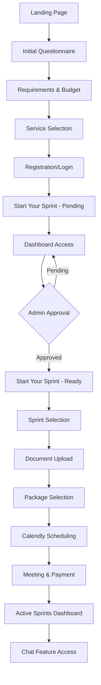
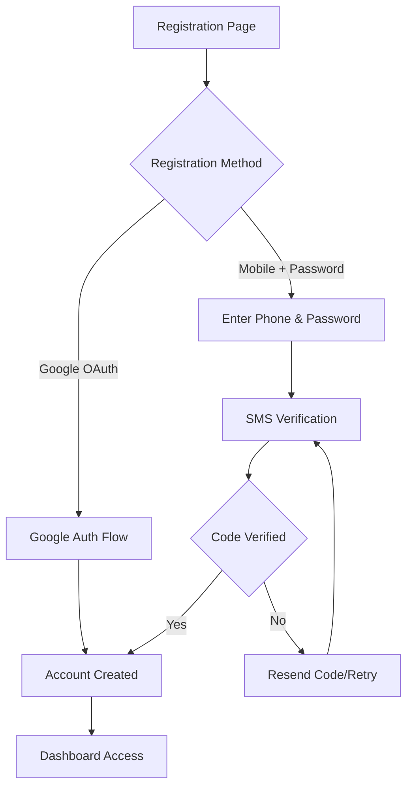
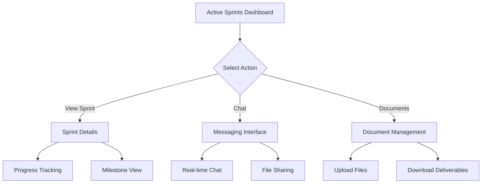

# Taotter Platform - User Flows

## Complete Client Journey

### Flow 1: New Client Onboarding

### Flow 2: Authentication Flow

### Flow 3: Sprint Management Flow

## Detailed User Flows

### 1. Initial Questionnaire Flow

**Step 1: Basic Information**

- User enters startup name
- Selects task type from dropdown
- Provides task description
- Indicates startup stage
- Sets key goals
- Chooses time commitment level

**Validation Rules:**

- All fields required except task description (optional)
- Startup name: minimum 2 characters
- Task description: maximum 500 characters
- Key goals: maximum 300 characters

**Navigation:**

- "Next" button to proceed to Requirements & Budget
- "Back" button to return to landing page

### 2. Requirements & Budget Flow

**Step 2: Project Scope**

- User selects desired milestones (checkboxes)
- Chooses timeline from dropdown
- Sets budget range using slider/dropdown

**Available Milestones:**

- Build MVP
- Validate Idea
- Market Research
- Branding & Design
- Technical Consulting
- Business Plan Development
- Custom (text field)

**Timeline Options:**

- 1-2 weeks
- 3-4 weeks
- 1-2 months
- 3-6 months
- 6+ months

**Budget Ranges:**

- $1,000 - $5,000
- $5,000 - $10,000
- $10,000 - $25,000
- $25,000 - $50,000
- $50,000+

**Navigation:**

- "Next" button to Service Selection
- "Back" button to return to Initial Questionnaire

### 3. Service Selection Flow

**Step 3: Service Options**

- Display sample service packages
- Option to select custom request
- Show package details and inclusions

**Sample Services (Admin Configured):**

- MVP Development Package
- Validation & Research Package
- Full Startup Launch Package
- Custom Solutions

**Navigation:**

- "Next" button to Registration
- "Back" button to Requirements & Budget

### 4. Registration Flow

**Authentication Options:**

- Google OAuth (single click)
- Mobile + Password registration

**Mobile Registration Process:**

1. Enter phone number
2. Create password (8+ characters, special chars)
3. Receive SMS verification code
4. Enter verification code
5. Account created

**Validation Rules:**

- Phone number: valid format, unique
- Password: minimum 8 characters, at least one special character
- SMS code: 6-digit verification

### 5. Post-Registration Flow

**Start Your Sprint (Pending State):**

- Welcome message displayed
- Processing status indicator
- Email notification sent
- Access to basic dashboard

**Dashboard Features (Pre-Approval):**

- View request status
- Edit profile information
- Contact support
- View submitted information

### 6. Sprint Selection Flow (Post-Admin Approval)

**Start Your Sprint (Ready State):**

- Display custom sprint options created by admin
- Show sprint details, duration, deliverables
- Allow sprint selection

**Sprint Information Includes:**

- Sprint name and description
- Duration and timeline
- Key deliverables
- Team members assigned
- Prerequisites/requirements

### 7. Document Upload Flow

**Dynamic Form Creation:**

- Admin-configured custom fields
- File upload requirements
- Form validation rules

**Common Document Types:**

- Business plan
- Technical specifications
- Design assets
- Market research
- Financial projections
- Brand guidelines

**Upload Features:**

- Drag & drop file upload
- Progress indicators
- File type validation
- Size limits enforcement

### 8. Package Selection Flow

**Package Comparison:**

- Side-by-side package comparison
- Feature matrix display
- Pricing information
- Engagement level details

**Package Attributes:**

- Price point
- Engagement time (hours/week)
- Team size
- Communication frequency
- Deliverables included
- Support level

### 9. Calendly Integration Flow

**Scheduling Process:**

- Embedded Calendly widget
- Available time slots display
- Time zone handling
- Meeting confirmation

**Meeting Types:**

- Initial consultation
- Project kickoff
- Weekly check-ins
- Final presentation

### 10. Active Sprint Management Flow

**Dashboard Features:**

- Sprint list with status indicators
- Quick actions per sprint
- Progress visualization
- Upcoming milestones

**Sprint Status Types:**

- Planning
- In Progress
- Under Review
- Completed
- On Hold

**Communication Features:**

- Real-time chat
- File sharing
- Message history
- Notification preferences

## User Experience Considerations

### Responsive Design

- Mobile-first approach
- Touch-friendly interactions
- Optimized for tablets and desktop

### Accessibility

- WCAG 2.1 compliance
- Keyboard navigation
- Screen reader compatibility
- High contrast mode support

### Performance

- Fast loading times
- Progressive loading for large forms
- Offline capability for chat
- Optimized file uploads

### Error Handling

- Clear error messages
- Inline validation
- Recovery suggestions
- Support contact options

## Navigation Patterns

### Primary Navigation

- Dashboard
- Active Sprints
- Profile
- Messages
- Support

### Secondary Navigation

- Sprint-specific menus
- Document management
- Settings
- Logout

### Breadcrumb Navigation

- Multi-step form progress
- Sprint hierarchy
- Document folder structure

## State Management

### User Session States

- Anonymous (pre-registration)
- Authenticated (post-login)
- Verified (post-SMS verification)
- Active (with ongoing sprints)

### Form States

- Draft (auto-saved progress)
- Submitted (awaiting review)
- Approved (ready for next step)
- Completed (fully processed)

### Communication States

- Online/Offline indicators
- Message delivery status
- Typing indicators
- Read receipts
